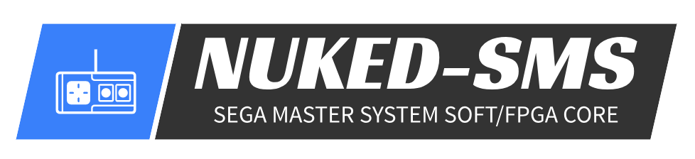

# Nuked-SMS-FPGA

by @nukeykt, @ogamespec and @andkorzh, special thanks to @HardWrMan

Cycle accurate Master System emulator. The goal of this project is emulate Sega Master System chipset accurately as possible using decapped chips photos.

## Master System chipset

US Sega Master System consist of 3 integrated cicuits + RAM, ROM chips:
* Zilog Z80 (CPU)
* Yamaha YM2602B (VDP)
* Sega 315-5216 (IO)

Nuked-SMS-FPGA currently targets US SMS model 1, thus SMS2/GG VDP extensions are not supported.

Additionally YM2413 is emulated.

## References
* https://github.com/emu-russia/SEGAChips (andkorzh, org, nukeykt)
* https://siliconpr0n.org/map/sega/315-5124/furrtek_mz/ (furrtek)
* https://siliconpr0n.org/map/sega/315-5216/furrtek_mz/ (furrtek)
* https://siliconpr0n.org/map/zilog/z0840008psc-z80cpu/ (Antoine Bercovici)
* http://www.visual6502.org/JSSim/expert-z80.html (Visual6502 team)
* https://siliconpr0n.org/map/konami/vrc-vii-053982/mcmaster_mz_mit20x/ (John McMaster)
* https://twitter.com/travisgoodspeed/status/1660312214945792001 (Travis Goodspeed)
